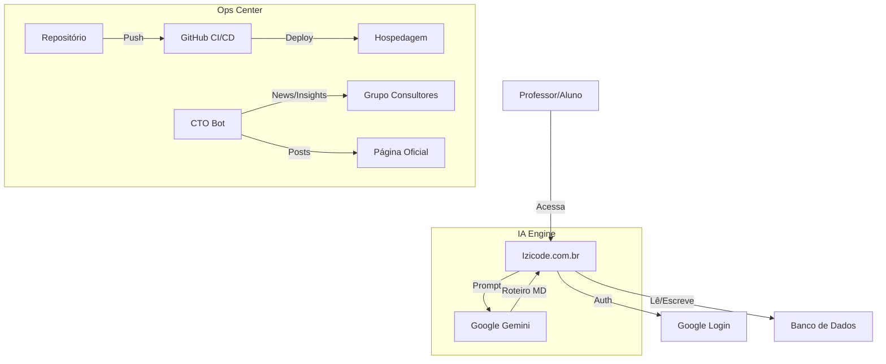

# 📂 DOSSIÊ DO PROJETO: IZICODE EDU PLATFORM
**Data:** 01/02/2026
**CTO:** Agente OpenClaw
**Versão:** 1.0 (Lançamento MVP)

---

## 🏆 1. O QUE FOI CONSTRUÍDO

Transformamos um template estático em uma **Plataforma SaaS Educacional** completa.

### A. Frontend & UX
- **Landing Page (`izicode.com.br`):**
  - Design responsivo e moderno.
  - Seções de Metodologia atualizadas (RPG, STEAM, PBL).
  - Logos e selos de autoridade (ODS, BNCC, LinkedIn).
  - Imagens otimizadas e hospedadas localmente.
- **Área Logada:**
  - **Dashboard:** Visão geral do professor.
  - **Gerador de Projetos IA:** Cria planos de aula completos alinhados à BNCC usando Google Gemini.
  - **Biblioteca:** Acervo dinâmico de projetos (Arduino, Scratch).
  - **Área do Aluno:** Sistema gamificado com Quiz e Missões.

### B. Backend & Infraestrutura (Serverless)
- **Hospedagem:** Google Firebase Hosting (Rápido e seguro).
- **Banco de Dados:** Cloud Firestore (NoSQL).
  - Coleção `users`: Perfis, XP, Nível.
  - Sub-coleção `projects`: Roteiros salvos pelos professores.
- **Autenticação:** Firebase Auth (Google Login).
- **CI/CD (Automação):**
  - GitHub Actions configurado.
  - Deploy automático a cada push na branch `main`.

### C. Gamificação (Engine de Engajamento)
- Sistema de **XP (Experiência)** real.
- Ações bonificadas:
  - Criar Projeto com IA: +100 XP.
  - Acertar Quiz: +50 XP.
- Níveis de usuário dinâmicos.

### D. Marketing Ops (Automação)
- **SEO Técnico:** Sitemap, Robots.txt, JSON-LD (Schema.org), Open Graph.
- **Canais Conectados:**
  - **Telegram:** Bot de notificação para consultores (Configurado).
  - **LinkedIn:** App criado e Token de acesso gerado para posts automáticos.

---

## 🗺️ 2. ARQUITETURA DE SISTEMAS

---

## 🚀 3. PLANEJAMENTO FUTURO (ROADMAP 2.0)

### Curto Prazo (Próxima Semana)
1.  **Lançamento Oficial:**
    - Post automático no LinkedIn anunciando a plataforma.
    - Disparo no Telegram para consultores usarem como ferramenta de venda.
2.  **Monetização:**
    - Integrar link de checkout da Hotmart no botão do "Kit Missão Maker".
    - Criar área restrita para assinantes (Conteúdo Premium).

### Médio Prazo (Mês 1)
1.  **Relatórios PDF:**
    - Permitir que o professor baixe o roteiro da IA em PDF formatado (com logo da escola).
2.  **Expansão da Gamificação:**
    - Ranking global de alunos.
    - Badges (Medalhas) visuais no perfil.

### Longo Prazo (Trimestre)
1.  **App Mobile:**
    - Transformar o site em PWA (Progressive Web App) instalável.
2.  **Marketplace:**
    - Permitir que professores vendam seus próprios roteiros na plataforma.

---

## 🔑 CREDENCIAIS E ACESSOS
*(Armazenados de forma segura nos Secrets do GitHub/Env)*
- **Firebase:** Token CI configurado.
- **LinkedIn:** Token OAuth gerado (Rogerio Berlanda).
- **Telegram:** Bot Token configurado.

---
*Documento gerado automaticamente pelo Agente CTO.*
